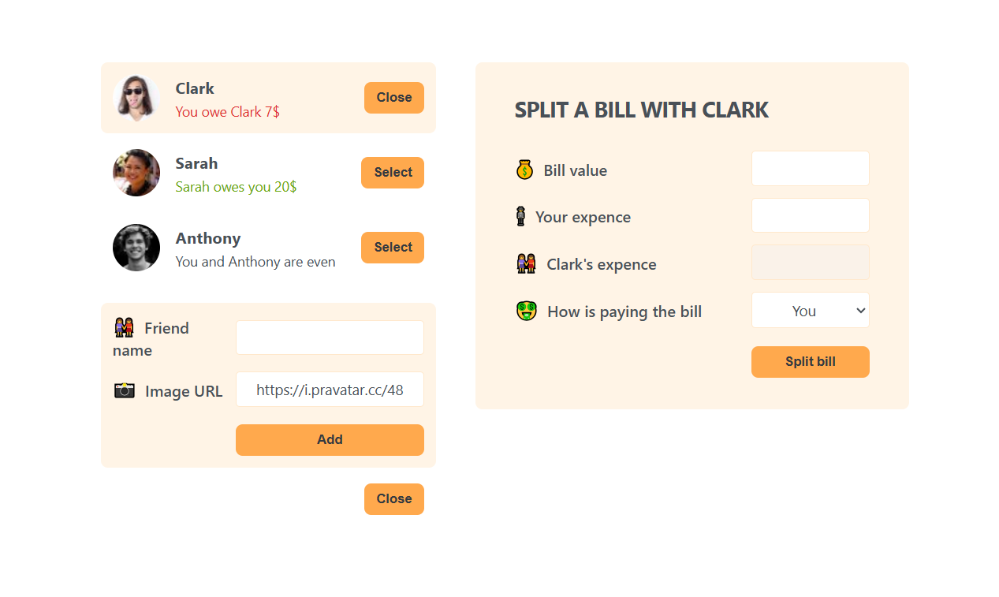

# 🍽️ Eat-N-Split – Bill Splitting Web App

**Eat-N-Split** is a simple and interactive React web application that helps users split bills fairly among friends. Whether it’s a dinner, trip, or group expense, this app makes it easy to track and share costs with transparency.

---

## 🚀 Features

- 👥 Add friends with names and avatars
- ✅ Select a friend to split a bill with
- 💰 Input bill amount, who paid, and how much each person owes
- 🔄 Automatically calculates the difference and updates balances
- 🎨 Clean and responsive UI
- ⚛️ Smooth component-based state management with React Hooks

---

## 🛠️ Tech Stack

- **React**
- **JavaScript (ES6+)**
- **CSS**
- Modular React Components
- useState for dynamic UI updates

---

## 📸 Screenshots



---

## 🌐 Live Demo

🔗 [Live Site](https://your-deployment-link.com)

---

## 📦 Get Started

```bash
git clone https://github.com/alaa-okasha/eat-n-split.git

npm install


npm run dev  # or npm start if not using Vite


```

---

## 🧠 What I Learned

- Building dynamic forms in React

- Lifting state up and passing props

- Managing lists and conditional rendering

- Clean UI/UX handling using state logic

---

## 📬 Contact

If you have any feedback or suggestions, feel free to reach out on [LinkedIn](https://www.linkedin.com/in/alaa-okasha-080162267) or open an issue!

---

Built with ❤️ by Alaa Okasha
